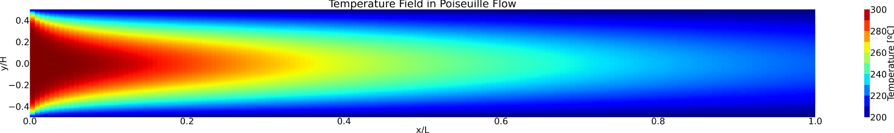
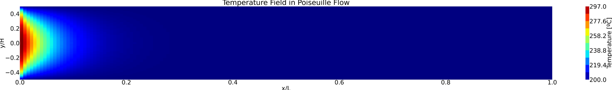
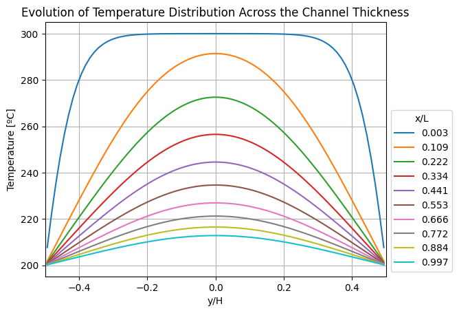

# Poiseuille Flow Heat Transfer Solver

This repository contains a **2D Finite Volume Method (FVM) solver** developed in **Python** for the steady-state convection–diffusion energy equation with viscous dissipation in a laminar **Poiseuille flow** between parallel plates.

## Overview

The solver is implemented in a modular **Jupyter Notebook**, combining:
- **Finite Volume Method (FVM)** discretization
- **Two linear solvers**: Direct (`numpy.linalg.solve`) and Iterative GMRES (`scipy.sparse.linalg.gmres`)
- **Parametric studies** of **Péclet** and **Brinkman** numbers
- **Post-processing** with contour plots and temperature profiles

The accompanying PDF report documents the **theory, methodology, results, and conclusions**.

---

## Features

- **Laminar Poiseuille flow** assumption with fully developed velocity profile  
- Handles **convection–diffusion equation** with optional **viscous dissipation**  
- Choice between **Direct Solver** (fast for small meshes) and **GMRES Iterative Solver** (scalable for larger grids)  
- **Mesh refinement study** (20×10 up to 160×80) to confirm mesh independence  
- **Parametric study** for **Péclet number** (Pe=1,10,100)  
- **Contour plots and profiles** generated automatically with Matplotlib  

---
## Repository Structure

- README.md #This file
- 2DPoiseuille_HeatTransfer.ipynb #Jupyter Notebook with full code
- Report-FVM-PoiseuilleFlow.pdf # Full Technical Report, with all the theory, methodology, results and conclusions!

## Example Results

### Temperature field generated for the case of Br = 0 (No viscous dissipation)

### Temperature field generated for the case of Pe = 10

### Temperature profiles generated for the case of Pe = 100

## Author

António Reis  
MSc Aerospace Engineering — Aerodynamics | CFD | Numerical Methods  
🔗 [LinkedIn](https://www.linkedin.com/in/antónio-reis-615471327)

